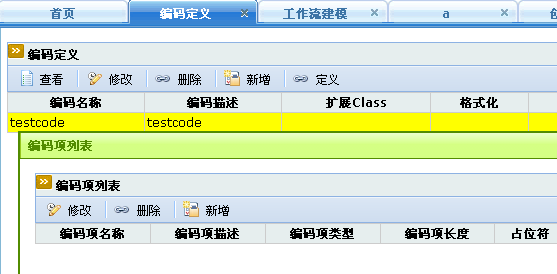

## 基本概念 ##

> 编码是唯一标识某些“业务对象”的代码，并用简单的代码表示丰富的含义，通常用几段区域构成。如学生编码的构成为 2位学院代码4位日期编码2位班级编码6位流水号构成。

> 编码在平台配置中有两个重要概念：

  1. 编码定义 DOCodeMain 一个编码定义包含一个或多个编码项目
  1. 编码项目 DOCodeItem  编码中具体每“一段”的详细定义

## 对应JAVA 数据类型 ##

> com.exedosoft.plat.bo.code.DOCodeMain

> com.exedosoft.plat.bo.code.DOCodeItem

## 配置 ##

> 编码生成器管理入口位于 首页==>编码生成器

> ### 编码定义 ###

> 新增或修改编码定义时，编码名称不可为空。

> 一个编码定义包含一个或多个编码项目，当新增编码项目时，顺序表示编码项目的位置。

> 

> ### 编码项目 ###

> 编码项目类型：

  1. 纯流水序号       流水序号一般以1开始，固定长度，如6位流水号以000001开始
  1. 组织年流水序号   流水序号按不同组织年份开始，如财务部2008年的以000001开始，技术部2008年也以000001开始，技术部2009年也以000001开始 _未实现_
  1. 按年流水序号    流水序号按不同年份开始，如2008年的以000001开始，2008年流水序号结束，2009年也以000001开始 _未实现_
  1. 按组织流水序号    流水序号按不同组织开始，如财务部000001开始，技术部也以000001开始
  1. 用户自定义序号    用户可以自定义序号，修改com.exedosoft.plat.util.sequence.UserDefineIDSequence 类
  1. 当期时间  当前操作时间
  1. 登录ID
  1. 登录名称
  1. 登录岗位
  1. 登录单位
  1. 固定值  固定值 如以'T'开头
  1. 参数    根据参数从总线上取值
  1. 类扩展  变量项目的值来自于类扩展

> 截取或补充方向：

  1. 左
  1. 右

> 编码长度：编码项目的值的长度，如果长度不够则以“占位符”补充，占位符默认为“0”，如6位流水号以000001开始，如果占位符“F”，则以FFFFF1开始，默认补充方向为“左”，如果补充方向为“右”，则以1FFFFF开始。

> 格式化：printf 风格的格式字符串的解释程序。此类提供了对布局对齐和排列的支持，以及对数值、字符串和日期/时间数据的常规格式和特定于语言环境的输出的支持。支持诸如 byte、BigDecimal 和 Calendar 等常见 Java 类型。任意用户类型的受限格式化定制都是通过 Formattable 接口提供的。 详见：http://gceclub.sun.com.cn/Java_Docs/html/zh_CN/api/java/util/Formatter.html。  例如 编码项目类型为当前时间（2010年12月28日），格式化为“%1$tY%1$tm”，结果为201012。

> 
