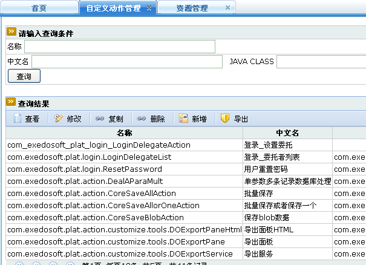

## 基本概念 ##

> 自定义动作是平台功能的扩展，即为了完成平台不能配置的功能。自定义动作有两种实现方式：

  1. 通过脚本在线编写
  1. 实现com.exedosoft.plat.action.Action接口或继承com.exedosoft.plat.action.DOAbstractAction抽象类

> 自定义动作的应用场景：

  1. 服务使用自定义动作：这时服务的执行委托给自定义动作，不再执行服务定义的SQL语句
  1. 参数使用自定义动作：自定义动作的返回值为参数的值
  1. 编码（CodeMain）使用自定义动作：自定义动作的返回值编码的值
  1. 编码项(CodeItem)目使用自定义动作：自定义动作的返回值为编码项目的值
  1. 通过平台提供的javascript callAction 的函数，直接调用自定义动作，完成前台和后台的直接交互

> 自定义动作一般继承DOAbstractAction抽象类，返回有以下情况

  1. 返回默认字符串 	 DEFAULT_FORWARD = "success"; NO_FORWARD = "noforward";  成功为success失败返回 noforward
  1. 返回对象列表  DOGlobals.getInstance().getRuleContext().setInstances(List<BOInstance> list);
  1. 返回对象 DOGlobals.getInstance().getRuleContext().setInstance(BOInstance ins); 
  1. 作为参数、编码、编码项的自定义动作直接返回对应的值 如果错误返回noforward
  
> 自定义动作默认属性

  1. java this.actionForm 操作当前的form对象;  js 用doform直接操作
  1. java this.setEchoValue("没有数据！");js 用 SessionContext.getInstance().getThreadContext().setEchoValue("批量删除完成！") ;
  
  

## 配置 ##

> 自定义动作管理入口位于 首页==>基础设施管理==>自定义动作管理。


> 

### java示例 ###
```
public class DeleteAllPerson extends DOAbstractAction {

	@Override
	public String excute() throws ExedoException {
		// TODO Auto-generated method stub
		// 获取Form节点
		BOInstance form = DOGlobals.getInstance().getSessoinContext()
				.getFormInstance();
		// 调用删除人员的服务
		DOService deleteService = DOService.getService("tbl_person_delete");
		// 获取Form节点中name为checkinstance的属性的值
		// 因为表格用的GridList控制器，在其配置的checkbox的name为checkinstance，(明细请
		// 参照/exedo/webv3/template/grid/GridList.ftl)
		// 因此获取Form节点中name为checkinstance的属性的值即可获得在页面中选择的要删除的人员列表
		String[] checks = form.getValueArray("checkinstance");
		if (checks == null && checks.length <= 0) {
			this.setEchoValue("没有数据！");// 在页面弹出提示框
			return NO_FORWARD;
		} else {
			// 循环调用删除服务
			for (int i = 0; i < checks.length; i++) {
				deleteService.invokeUpdate(checks[i]);
			}
		}
		return DEFAULT_FORWARD;
	}

}
```

### JavaScript示例 ###
```
var ret ; //返回值声明

var DEFAULT_FORWARD = "success";
var NO_FORWARD = "noforward";

var sSubmit = doservice.getService("tbl_person_delete");//调用删除人员的服务
var checks=doform.getValueArray("checkinstance");//获取Form节点中name为checkinstance的属性的值

if(checks !=null && checks.length >0){
  // 循环调用删除服务
    for(var i = 0 ; i <  checks.length ; i ++){
      var rid = checks[i] ;
      sSubmit.invokeUpdate(rid) ; //rhino js是老版本的,这个rid参数要用[]包起来
    }
    SessionContext.getInstance().getThreadContext().setEchoValue("批量删除完成！") ;
    ret = DEFAULT_FORWARD ;
}else{
    SessionContext.getInstance().getThreadContext().setEchoValue("没有数据！") ;
    ret = NO_FORWARD ;
}
ret ; //返回值 
```
