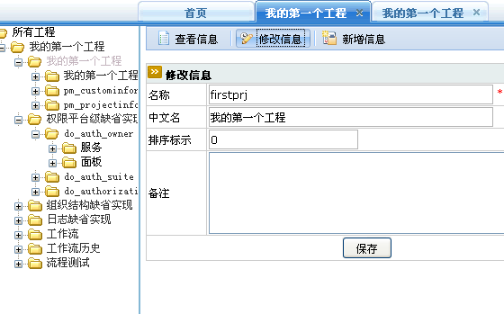

## 基本概念 ##
> 业务包是从业务划分的业务对象的集合。

## 对应JAVA 数据类型 ##
> com.exedosoft.plat.bo.BusiPackage

## 配置界面 ##
> 

> <b> 注意：</b>

> 名称不可含有中文或全角字符。
> 排序标示是指 业务包在树上的位置。

> 如果业务对象较多，一定要用业务包划分，点击上图的新增信息就可以创建新的业务包。初始化业务对象时，可以把业务对象初始化到业务包里面，也可以初始化后修改业务对象的业务包属性。

> 属性详解
- 名称：业务包英文名称 英文非重复
- 中文名：中文名
- 工程：所属工程
- 排序标识：排序
- 备注：备注
