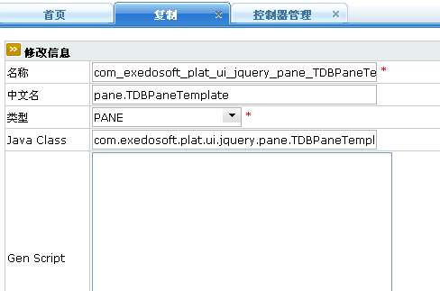
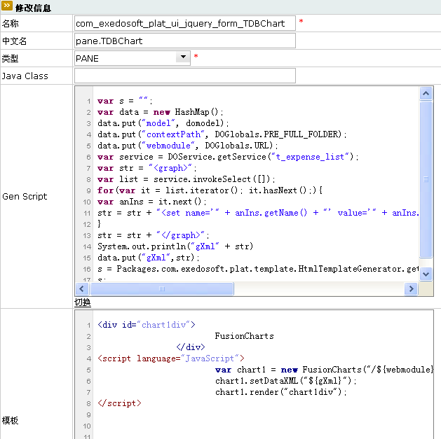

## 基本概念 ##

> 界面组件是EEPPlat UI部分的核心概念，界面组件在老版本的平台概念中也可以成为 **控制器** ，和MVC模式中的控制器概念不完全一致。 EEPlat中界面展示都是通过各种界面组件控制输出的。传统的MVC模式，一个界面往往对应一个独立的页面，由于业务的复杂性和多样性，这个页面很难复用，当然也有其他的一些手段风格页面，但是这些这些技术手段往往复杂而繁琐， 这也是传统MVC模式在复用方面无法做到更细更深层次的一个根本原因。由于EEPlat采用HMVC模式，并且通过模型天然的拓扑结构进行驱动显示，使得界面层能够实现从粗粒度到细粒度的灵活的复用，也就是说从比较大的界面区域到最细粒度的界面元素都能够得到良好的复用支持。

### 界面组件分类 ###

> 界面层模型主要包括：面板、表格、表格元素、功能树和菜单五类基本概念。

> 相应的从概念分类分为：
  1. 面板界面组件（pane）
  1. 表格界面组件（grid）
  1. 表格元素界面组件（form）
  1. 功能树界面组件（tree）
  1. 菜单界面组件（menu）

> 界面组件分类说明（左侧索引）包含了 大部分典型的缺省实现，可以直接使用，也可以作为个性化实现的参考。

> UI及控制器的结构图：

> 

> 

### 从复用场景上分为通用界面组件和界面组件 ###

> 通用界面组件 即基本上是各应用场景均能用到的和应用无关的控制器，如常见各种表格、各种表格元素、各种按钮形式等。

> 项目专用界面组件 是指为了满足某一特定的项目的需求而开发的智能应用于该项目特定场景吓的控制器，这类界面组件无法在更通用的层次复用，只能在该特定应用场景下复用。

### 界面组件有以下几种实现方式 ###

  1. 通过脚本在线编写，采用在线的JavaScript脚本和freeMarker脚本开发控制器，此类控制器在线开发即时执行，无需编译，存储在系统模型数据库中，因而在在线开发方面具有很好的优越性；此类控制器从名称上最后一部分名字以TDB开始，如：pane.TDBPaneTemplate、grid.TDBGridTemplate等。
  1. 实现com.exedosoft.plat.ui.DOIView接口，可以实现所有类型的界面组件，即控制器的实现为一个Java类，此类控制器的开发、扩展修改需要编译后才能被使用；
  1. 实现com.exedosoft.plat.ui.DOIViewTemplate接口或继承com.exedosoft.plat.ui.DOViewTemplate抽象类，结合FreeMarker模板文件可以实现所有类型的控制器，由于采用了模板，所以此类界面组件的开发相对更加简洁
  1. 
    * 实现com.exedosoft.plat.ui.jquery.form.DOBaseForm，实现表格元素类型的界面组件
    * 实现com.exedosoft.plat.ui.jquery.menu.DOBaseMenu，实现菜单类型的界面组件
    * 实现com.exedosoft.plat.ui.jquery.pane.TPaneTemplate,结合FreeMarker模板，实现面板类型的界面组件

## 对应JAVA 数据类型 ##
> com.exedosoft.plat.ui.DOController

## 配置 ##

> ### 注册、管理控制器 ###

> 控制器管理入口位于 首页==>基础设施管理==>界面组件管理。

> 

> ### 复制界面组件 ###

> 注册界面组件时，可以采用新增或复制的方式，推荐用复制的方式注册新的界面组件，如下图

> 

> ### 通过脚本在线编写 ###

> 可以通过脚本在线编写新的界面组件，分为两部分，第一部分是脚本准备数据；第二部分是显示模板。如下图：
> 
