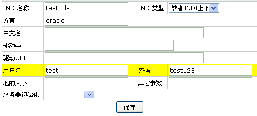
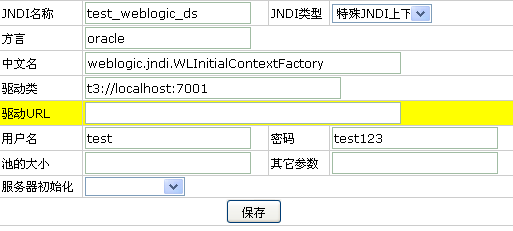
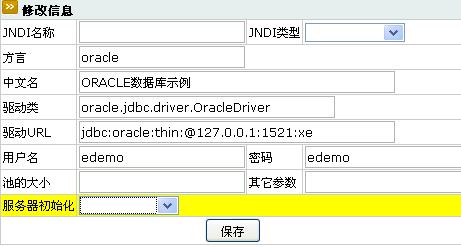
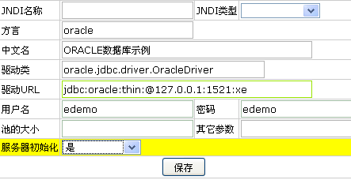

## 基本概念 ##

> 在数据源中存储了所有建立数据库连接的信息。就象通过指定文件名你可以在文件系统中找到文件一样，通过提供正确的数据源名称，可以找到相应的数据库连接。平台提供了三种连接数据库的方式：

  1. JNDI方式。     数据库的连接信息存储在SEVLET容器或应用程序服务器中（tomcat,weblogic,websphere等），由其提供数据库的连接池，推荐用这种方式。
  1. 直接JDBC连接。      数据库连接信息存储在平台中，每次数据库访问都会请求一次数据库连接
  1. 平台提供的数据库连接池。        数据库连接信息存储在平台中，和JDBC唯一不同的是“服务器初始化”选择是，数据库访问会从平台提供的数据库连接池请求连接

> 数据源一定要填写方言，支持的方言有：

  1. oracle
  1. sqlserver
  1. db2
  1. mysql
  1. hsqldb
  1. fromcofig  根据配置文件的数据库连接信息，配置文件要放在classes下面，配置文件的名称放在备注字段
  1. default  平台不直接支持的数据库类型

## 对应JAVA 数据类型 ##
> com.exedosoft.plat.bo.DODataSource

## 配置界面 ##

> 数据源管理入口位于 首页==>基础设施管理==>数据源管理

> 

> ### JNDI 缺省Context方式 ###

> 

> ### JNDI 特殊Context方式 ###

> 以 weblogic 为例：

> 

> ### 直接JDBC连接 ###

> 

> ### 平台提供的数据库连接池 ###

> 
