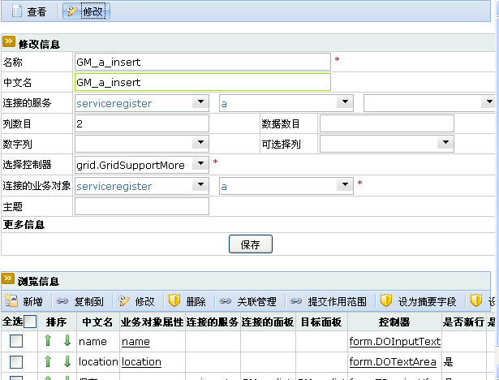
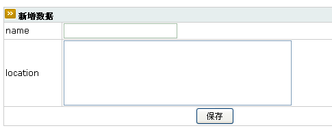
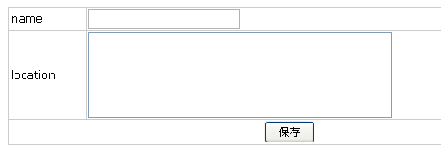

## 基本概念 ##

> 表格是数据的重要展示方式，一般分为表单视图（常作为显示单条数据），网格视图（常作为显示多条记录）。 表格的显示结构由表格元素构成，显示数据由表格对应的服务执行后返回的数据填充。当一个数据表被初始化为业务对象后，会形成6个基本表格，命名规则是GM + 业务对象名称 + `_` + 后缀，后缀分别为Condition、Result、browse、insert、list、update。

> 表格的显示由表格界面组件控制。

## 对应JAVA 数据类型 ##
> com.exedosoft.plat.bo.ui.DOGridModel

## 配置 ##

> 表格的配置分为两个上下两个部分，上面的部分为表格的基本信息维护，可以对表格进行修改；下面的部分为表格元素的维护，可以对表格元素修改、设为摘要字段、设为普通字段、设置关联关系、提交作用范围，新增表格元素，删除表格元素，复制表格元素。表格与表格元素之间是一对多的关系。

> 

> ### 主题 ###

> 表格的主题，如果不设置在不显示，下图为设置和不设置主题的对比：

> <b>设置主题</b>

> 

> <b>未设置主题</b>

> 

> ### 列数目 ###

> 表单视图下，每行显示多少个表格元素。默认情况下会显示2个表格元素。

> ### 数据数目 ###

> 网格视图下，每页数目条数，默认设置的数据为每页显示10条记录，如果不设置则不分页。

> ### 控制换行 ###

> 表单视图下，“是否换行”设置为“是”时，后续的表格元素会重起一行。

> ### 数字列 ###

> 网格视图下，表格可以支持数字列显示，需要数字列要选择“是”，数字列显示在表格的第一列。

> ### 可选择列（CHECKBOX） ###

> 网格视图下，表格可以支持CHECKBOX选择，可以通过CHECKBOX选择数据供下一步处理。

> ### 文字换行 ###

  1. NOWRAP\_NO   标题和数值都可以文字换行
  1. NOWRAP\_YES   标题和数值都不用可以文字换行
  1. NOWRAP\_YES\_LABEL  标题不可以文字换行
  1. NOWRAP\_YES\_VALUE  数值不可以文字换行

> ### 表格事件订阅 ###
> > 一般网格视图下有效（有些界面组件的可能未实现）
  1. SUBSCRIBE\_NO   不订阅事件
  1. SUBSCRIBE\_ALL  订阅所有事件
  1. SUBSCRIBE\_NODBLCLICK  订阅除双击之外的所有事件

> ### 过滤方式 ###
> > 网格视图下有效

  1. FILTER\_TYPE\_NULL    对表格元素不过滤
  1. FILTER\_TYPE\_OPERATION  只对表格外的“表格元素”过滤
  1. FILTER\_TYPE\_ALL  对所有表格元素过滤

> ### 默认显示数据 ###

> 在上下面板的情况下，上面板是查询条件，下面板是查询结果，下面板对应的表格默认情况下是显示查询数据的，可以把“默认显示数据”设置为“否”，这样就不再显示数据了。

> ### 连接的服务 ###

> 连接的服务执行结果为表格的显示提供数据。一般情况表格都需要定义服务，在只需要用户填充数据的表格（如新增类表格）中可以不定义服务。

> ### 连接的第二服务 ###

> 在某些界面组件的实现上，需要两个服务。 如果需要多个服务，可以把服务定义在表格元素上。表格元素设置为不显示。
