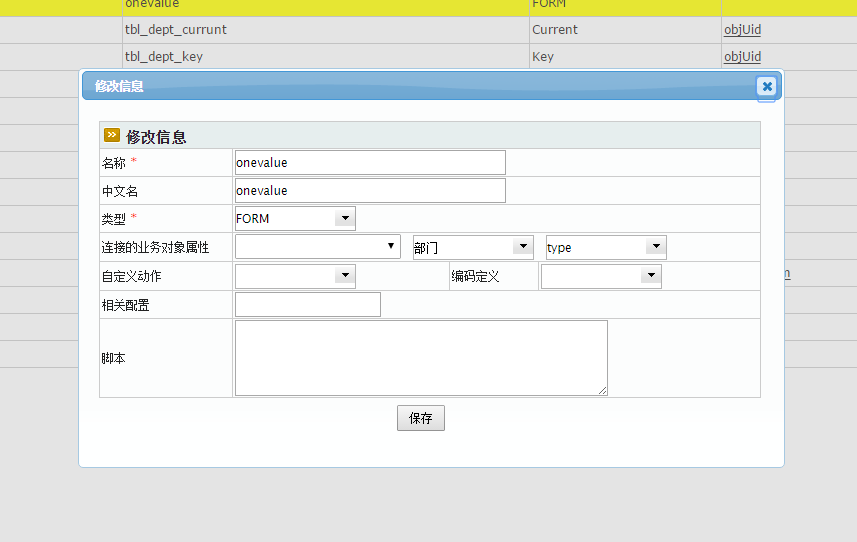

## 基本概念 ##

> 参数的作用主要是从业务对象总线上获取对应的值。服务可以不定义参数，也可以定义一个或多个参数。服务中sql语句中的？的数量要和参数的数量相同，并且按顺序对应（带通配符的服务，如自动条件查询，执行中，平台会自动根据参数补全sql）。这样服务就通过参数获取总线上的值。

> 如果界面的表格元素采用重命名的方式，那么建立一个新的参数，参数的名称和表格元素重命名的名称一致，不定义业务对象属性，那么通过这个新建立的参数就可以得到表格元素对应的值。


> 参数类型：

> <b>CURRENT：业务对象当前值 当前操作的对象</b>

> 产生来源：
    * 用户当前的点击选中
    * 服务（刷新类型不是REFRESH\_NO）执行后对业务对象新增一条记录或修改一条记录，那么这条记录作为CURRENT。
    * 服务执行查询后，如果刷新类型为REFESH\_CURRENT，REFESH\_ALL，如果查询返回多条记录，则把第一条作为CURRENT,如果查询结果集为空，则不刷新。

> 默认情况下，只有ID字段生成了CURRENT类型的参数，但是其他字段和ID是等同的，可以通过增加参数的办法新增CURRENT类型的参数。

> <b>Current_Multiple：当前操作的多个业务对象的</b>

> <b>GLOBAL：全局当前值 CURRENT是一个业务对象的uid，global是只存储一份数据，global是当前点击的业务对象的数据 全局的</b>

> 产生来源：
> 服务执行查询后，如果刷新类型为REFESH\_CURRENT，REFESH\_ALL，如果查询返回多条记录，则把第一条作为CURRENT,如果查询结果集为空，则不刷新。


> <b>LOGIN 当前登录人的uid，LOGIN_NAME，LOGIN_MAIN_STATION，LOGIN_MAIN_DEPT，LOGIN_KEY：登录相关 </b>

> 参见[业务对象总线USER的获取](BusinessObjectBus.md#USER%E7%9A%84%E8%8E%B7%E5%8F%96)


> <b>DATE：当前时间，java.sql.Date 类型 相关配置为-7 表示7天前的日期 +7 表示7天后的日期 </b>

> <b>Datetime：当前时间年月日时分，java.sql.Date 类型  相关配置为-7 表示7天前的日期 +7 表示7天后的日期 </b>

> <b>TIMESTAMP：当前时间，java.sql.Timestamp 类型  相关配置为-7 表示7天前的日期 +7 表示7天后的日期 </b>

> <b>FORM：来自界面 URL 用户提交的数据等 传递过来的数据 都会放在form中</b>

> 参见[业务对象总线FORM节点](BusinessObjectBus.md#FORM%E8%8A%82%E7%82%B9)


> <b>FORM_CAL：可以写一些表达式 用于form计算 来自界面，可以把多选的值以;分割存放</b>

> <b>NULL：NULL值 </b>

> <b>RECURSION_PARENT：CURRENT子类型，递归情况下父亲的值 </b>

> <b>KEY：主键 </b>

> <b>CODE：使用编码生成器，需要指定编码生成器 </b>

> <b>SCRIPT：参数的值来自于脚本，脚本填写在备注中 </b> 
```
例如（把传入的itemname的中文翻译成英文，调用平台的pinyin类）：
var re=com.exedosoft.plat.util.PinYinUtil.getPinYin(doform.getValue("itemname"));
re;
```
> <b>ACTION：参数的值来自于自定义动作，需要指定自定义动作 </b>
```
如：Action代码（把传入的itemname的中文翻译成英文，调用平台的pinyin类）
public class GetPinyinAction extends DOAbstractAction{
	@Override
	public String excute() throws ExedoException {
				return PinYinUtil.getPinYin(this.actionForm.getValue("itemname"));
	}
}
```
> <b>MD5：FORM类型的子类型，对相应值做MD5运算 </b>

> <b>SHA：FORM类型的子类型，对相应值做SHA运算 </b>

> <b>SECURITY_REVERS：FORM类型的子类型，对相应值做可逆的加密算法 </b>

> <b>LUCENE_SEARCH：FORM类型的子类型，使用LUCENE查询时，自动把LUCENE和数据库管理 </b>

> <b>LUCENE_CREATE：FORM类型的子类型，当数据保存时，自动创建LUCENE索引 </b>


## 对应JAVA 数据类型 ##
> com.exedosoft.plat.bo.DOParameter

## 配置界面 ##

> 

## 属性详解 ##

- 名称：一个属性的对应多个参数，中文名可以不一致 名称必须一致 名称是参数传递和替换的一个基准 
- 中文名：参数中文名
- 类型：详见上
- 连接的业务对象属性：关联的业务对象的属性
- 自定义动作:通过自定义动作获取参数值 对应类型Action
- 编码定义:选择一个编码定义 对应类型code
- 相关配置:用户补充配置
- 脚本:js代码，对应类型脚本
