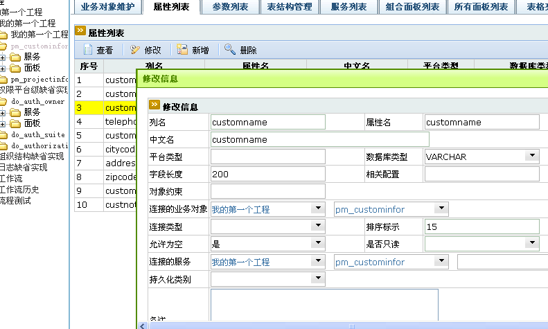

## 基本概念 ##

> 业务对象属性指业务对象所拥有的属性。对于类型为基本表的业务对象，属性基本是相应表的列名。但是属性可以不对应列，列也可以不对应属性。

> 属性可以是一个集合，为属性定义一个查询服务，属性对应的是该服务执行返回的集合。这种情况下一般用于处理业务对象之间一对多或多对多的情形。

> 属性的类型影响查询后数据的类型，如果数据库中表的类型修改后，属性的类型也要进行修改。

> 参数一般会关联属性，表格元素一般也会关联属性，表格元素被提交后存储于业务对象总线上FORM节点的KEY指使表格元素关联属性的名称（如果表格元素进行重命名那么用重命名的值）。参数根据关联属性的名称从业务对象总线中取值（如果没有关联属性或根据关联属性没有取到值，则根据参数名称）。

## 对应JAVA 数据类型 ##
> com.exedosoft.plat.bo.DOParameter

## 配置界面 ##

> 

> 可以通过属性列表界面，查看、新增、修改、删除一个业务对象属性。

> 当新增业务对象属性后，系统会自动增加一个对应的参数，如果属性的持久性类型为YES，则会同时修改缺省实现的以_update、_insert结尾命名的服务的sql语句。

> 删除时，系统会自动删除对应的参数，如果属性的持久性类型为YES，并会修改缺省实现的以_update、_insert结尾命名的服务的sql语句。

> <b>   修改时，系统不会做相应的操作，需要手动修改。</b>

> 配置项概述：

- 列名：如果为数据库关联，则一般为字段名需要与数据库一致；
- 属性名：属性名字 一般和数据库字段名保持一致 也可以不同
- 中文名：中文名称
- 平台类型： 一般为自动匹配 也可不定义 支持常见类型 及三个JSON类型，对象列表和JSON串
- 数据库类型：数据库的数据类型 JDBC对数据库的抽象
- 字段长度：字段的长度
- 相关配置：用于补充属性的配置
- 持久化类别：yes存储数据库内 no不存储数据库 
- 连接的业务对象：用于父子连接是的父业务对象
- 是否为空 是否只读 约束
- 连接的服务：用于获取集合关联到属性类型JSONArray
- 缺省值：系统默认的值
- 备注：备注

> <b> 注意：</b>

  * 如果属性对应于数据表中的列，则不能为空
  * 数据库类型来自于java.sql.Types,并不是物理数据库的类型。
  * 平台内部基本处理类型包括STRING，INT，LONG，DOUBLE，DATE，TIMESTAM，CLOB，BLOB；一般不需要指定，会自动进行匹配。

　

