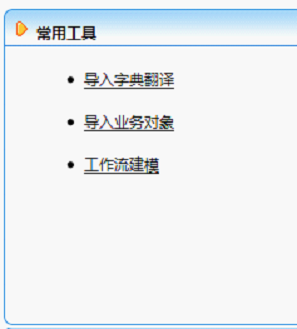
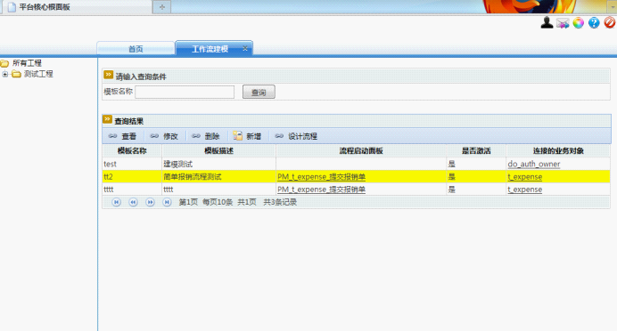
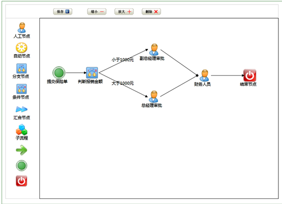
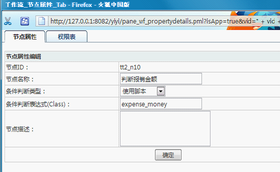
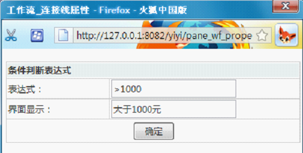

# 工作流概念 #

> <b>工作流(Workflow)</b>，是“业务过程的部分或整体在计算机应用环境下的自动化”，它主要解决的是“使在多个参与者之间按照某种预定义的规则传递文档、信息或任务的过程自动进行，从而实现某个预期的业务目标，或者促使此目标的实现”。

> <b>流程模板</b>：用来描述业务流程的模板，流程模板定义了工作流的节点、转移、业务数据（一般是业务对象）等信息。对应JAVA类型：com.exedosoft.wf.pt.ProcessTemplate

> <b>流程模板变量</b>：流程模板变量被流程模板内的节点和转移共享，可以在节点间传递数据或作为条件分支的判断表达式。 对应JAVA类型：com.exedosoft.wf.pt.PTVar

> <b>业务数据</b>：指与用户交互时产生的数据，这部分数据与具体的业务相关，例如一个销售单，在平台中是销售单这个业务对象。 对应JAVA类型：com.exedosoft.plat.bo.DOBO ,ProcessTemplate 对 DOBO 有引用。

> <b>节点</b>，又称为活动等。工作流模板是由一个个节点按照一定顺序组成的，平台中工作流节点的类型： 对应JAVA类型：com.exedosoft.wf.pt.PTNode

  1. 开始节点  一个流程中只能含有一个开始节点
  1. 结束节点  一个流程中可以含有多个结束节点
  1. 人工节点  需要人工参与，流程才能继续往下走
    1. 流程状态 流程进入此节点时显示的流程状态
      - 回退时状态 流程回退时显示的流程当前状态
  1. 自动节点  节点的主体是定义一个服务，自动执行后流程继续往下走
  1. 循环节点  节点是一个循环，例如一个文件需要一组人循环签署，建模时可以把节点定义为人工节点，然后用自定义动作实现
  1. 无条件分支  一个节点无条件流向多个节点
  1. 条件分支    条件成立时，流向某一个节点
  1. 汇合节点    多个节点流向汇合节点，这多个节点全部执行完后，流程才继续往下走
  1. 自动汇合节点  一般用用于自动会签，平台不直接支持，建模时可以把节点定义为人工节点，然后用界面组件实现
  1. 子流程节点  启动子流程

> <b>转移</b>，也成为转移线等。转移连接节点和节点，条件分支节点连出的转移线需要转移条件，转移条件可以使用是一个表达式（符合javascript语法，例如 > 5，条件分支节点会定义判断表达式a，“判断表达式”和“转移表达式”共同成 a > 5的完成的判断表达式，如果需要同时满足两个条件 ` > 5 || #value# < 0 `，替换后`  a > 5 || a < 0 ` ）。更复杂的判断需要实现com.exedosoft.wf.WFJudge接口的类，这个类的返回结果相当于“判断表达式”，一般返回1或0，“转移表达式”对应于1或0。

> 流程模板执行后对应的是实例：
  1. 模板实例（流程实例） com.exedosoft.wf.wfi.ProcessInstance，对应数据表：do\_wfi\_processinstance
  1. 节点实例 com.exedosoft.wf.wfi.NodeInstance，对应数据表：do\_wfi\_nodeinstance
  1. 流程模板变量实例 com.exedosoft.wf.wfi.VarInstance 对应数据表：do\_wfi\_varinstance

> 流程完成后对应的是工作流历史：

  1. 流程历史 com.exedosoft.wf.wfi.ProcessInstance，对应数据表：do\_wfi\_his\_processinstance
  1. 节点历史 com.exedosoft.wf.wfi.NodeInstance，对应数据表：do\_wfi\_his\_nodeinstance
  1. 流程变量历史 com.exedosoft.wf.wfi.VarInstance 对应数据表：do\_wfi\_his\_varinstance

# 流程示例运行简介 #

> 平台提供了一个报销流程的实例，报销人员填写报销单后提交流程，根据报销金额的不同转向副总经理或总经理审批，最后由财务主管处理完成整个报销流程。

> 报销单业务对象：t\_expense， 包含以下属性：

  1. title   报销事由（报销主体）
  1. expense\_man  报销人
  1. expense\_date 报销日期
  1. expense\_money 报销金额

> 参与角色如下：

> |<b>登录账号</b>|<b>登录密码</b>| **姓名**	|  **角色**      |
|:------------------|:------------------|:-----------|:-----------------|
> |  xw	        |      1	  |  小王	|  普通员工	|
> |  xz	        |      1	  |  习总	|  财务主管	|
> |  wz	        |      1	  |  温总	|  副总经理	|
> |  hz	        |      1	  |  胡总	|  总经理      |

  1. 以xw登录，填写报销单，金额为800 2000两个报销单。
  1. 以wz登录，审批800的报销单
  1. 以hz登录，审批2000的报销单
  1. 以xz登录，审批800/2000的报销单，流程完成后，然后进入历史数据库。

> 下面介绍一下配置过程，工作流设计器从配置管理平台首页进入，如下图：

> 

> 点击“工作流建模”，进入如下界面：

> 

> 选择“简单报销流程测试”（上文提到“报销流程的实例”），点设计流程，进入如下设计界面：

> 

> 流程由一个判断节点和三个审批节点组成，判断节点判断报销金额，大于1000元和小于1000元分别走不同的分支。
> 双击节点进入节点属性编辑界面：

> 

> expense\_money为工作流处理的业务对象的属性，针对该属性直接进行判断。双击节点流线进入流向属性界面，如下图所示：

> 

> <b> 关联流程 </b>
> 把t\_expense业务对象关联到“简单报销流程测试”下面， 点击“生成关联”即可，生成的过程可能持续10几秒时间。

> 

# 工作流权限 #

> ### 工作流权限可以支持以下类型： ###

  * <b>标准权限表:</b>  缺省的权限类型，也是最重要的权限类型，权限验证基于设定的权限表，使用系统缺省提供的wf\_db、wf\_yb、wf\_bj视图即可以自动基于标准权限表得到想对应的待办、已办、办结任务。

  * <b>数据拥有者:</b>   只有业务记录数据的拥有者才可以处理想对应的任务。 需要自己写特殊的待办视图。

  * <b>运行时指定用户:</b>   运营时，由上一个节点决定下一个节点的用户。  需要待办视图：wf\_db\_schedule
  * <b>运行时指定角色:</b>   运营时，由上一个节点决定下一个节点的角色。需要自己写特殊的待办视图。

  * <b>使用脚本：</b>  使用javascript脚本过滤任务数据。只能通过API的方式获取待办数据。
  * <b>使用JAVA类：</b>  使用java类过滤任务数据。只能通过API的方式获取待办数据。

> ### 运行时指定用户 ###

> 运行时指定用户，需要上一个节点通过界面选择下一个节点的执行人。界面需要自己配置，选择的文本框的名称为scheduleIds，执行完选择操作点击工作流提交后，工作流引擎会自动进行权限指定。
