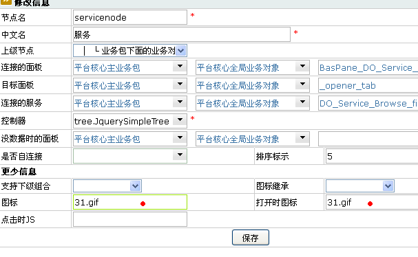

## 基本概念 ##

> 树是数据的树形展示方式。一般树所展示的是层次结构的数据，并且数据量不大。

> 树由节点构成，节点和节点之间是上下层次关系。

> 一般节点需要定义一个服务，该服务对应的业务对象必须定义主键列和特征值列，并且该服务对应的select sql语句中也必须含有主键列、特征值列这两个字段。

> 配置期树和运行期树的节点的不同：配置期树的节点一般会产生多个运行期树的节点，即配置期树的节点对应的服务执行结果产生了运行期树的节点。

> 节点可以不定义服务，这时候就是一般作为分类的用途，把下面的节点归为一类。

> 连接的面板，在运行期点击树节点时，响应的面板。

> 目标面板：在运行期点击树节点时，响应的面板所展示的位置。

> 没有数据时的面板：在运行期点击树节点时（这时候树节点的名称一般为新增），当没有数据值，响应的面板。

> 树的展示样式由树界面组件控制。

## 对应JAVA 数据类型 ##
> com.exedosoft.plat.bo.ui.DOTreeModel

## 配置 ##

> ### 创建树 ###

> 

> ### 管理树 ###

> 

> ### 换图标 ###
> > 图标的位置位于：web\default\images\icons。目录中里面提供了一些常用的图标，也可以把自己的图标放入。为了实现打开、关闭的效果，打开和关闭的图片可以不同。

> 
