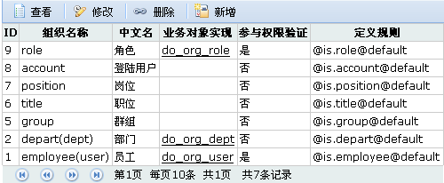
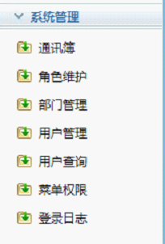
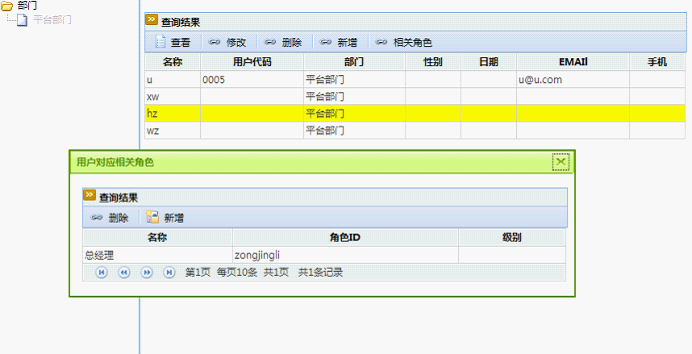

# 组织定义 #

> 系统对组织结构进行了高层抽象，提出了Parter(参与者)的概念，每一个类型的组织结构（如部门、员工、集团公司、事业部等）都可以注册为Parter。组织结构可以增加、删除、替换，所以平台的组织结构不是死板的、一成不变的，是灵活的、可以扩展的。

> 组织定义入口为，首页==》基础设施管理==》组织定义，下图是组织定义的界面：

> 

# SESSIONPARTER.CLASS #

> 系统提供了可扩展的权限验证方式，globals.xml文件可以定义可替换的sessionparter.clas类，sessionparter.class需要实现com.exedosoft.plat.bo.org.SessionParter 接口，默认实现为com.exedosoft.plat.SessionParterDefault。

> sessionparter.class的核心方法说明：

  1. getParterAuths()   并不是所有的Parter都参与权限验证，这里可以定义参与验证的Parter
  1. getMenuAuthConfigByAccount()   根据登陆者账号获取所有有权限的菜单，实现这个接口后可以提高首页的加载速度。  这个方法的实现一般已经包含了getMenuAuthConfigByRole()，所以只实现这个方法即可。
> > 一个实现的例子：
```
 
  	       ///定义返回的授权菜单列表 
		List authMenuUids = new ArrayList();
		////定义服务，该服务可以根据用户查找所有授权的菜单
		//该服务基于平台的缺省实现，即菜单只对角色授权，服务对应的SQL语句
		// SELECT a.objUID, a.whatUid
		// FROM do_authorization a INNER JOIN
		// do_org_user_role ur ON a.ouUid = ur.ROLE_UID
		// WHERE (a.whatType = 16) AND (ur.USER_UID = ?)
		DOService rfService = DOService.getService("s_menu_byuserid");
		//////////执行服务，并组装到authMenuUids
		List rfList = rfService.invokeSelect(accountUid);
		for (Iterator it = rfList.iterator(); it.hasNext();) {
			BOInstance bi = (BOInstance) it.next();
			authMenuUids.add(bi.getValue("whatuid"));
		}

```
  1. getMenuAuthConfigByRole()   根据登陆者角色获取所有有权限的菜单，实现这个接口后可以提高首页的加载速度


# 平台缺省提供的组织管理简介 #

> 以u/1111登录，可以看到系统默认的组织权限管理，如下图：

> 

> ## 通讯薄：查看用户信息 ##

> ## 角色维护：维护角色基本信息 ##

> ## 部门管理：维护部门基本信息 ##

> ## 用户管理：以部门结构为索引，管理用户信息，同时设置用户拥有的角色 ##

> 

> ## 用户查询：查询用户基本信息 ##

> ## 菜单权限：显示菜单，设置菜单使用的角色 ##

> !imgs/auth_menu_role.png](imgs/auth_menu_role.png)
