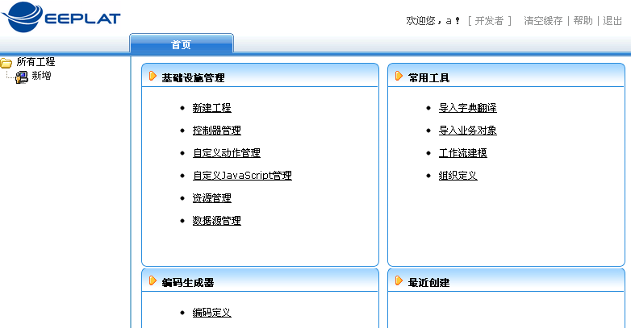

### 安装要求： ###
  1. JDK 1.6版本或以上（如果需要1.5版本，请替换[特殊JAR包](JDK15.md)）。
  1. WEB容器，如TOMCAT,RESION,WEBLOGIC,WEBSPHERE等，需要相应版本支持JDK1.5或以上,WEB容器的安装路径不要含有中文或空格。
  1. 建议安装FireFox。系统开发使用在FireFox上效率最高速度最快。

### 安装详细步骤： ###
**下面以TOMCAT5.5为例安装EEPLAT。**

  1. 请从[Downloads](imgs/eeplat.war)下载适合自己的版本，一般下载最新版本即可，下载后吧war包的名字改为eeplat.war。或从
  官网www.eeplat.com 首页下载. 把下载文件eeplat.war拷贝到tomcat目录下webapps目录下面。
> > 
  1. 拷贝完成后，启动tomcat。启动完成后，即可进入配置开发界面，地址为http://127.0.0.1:8080/eeplat/exedo/webv3/， 需要根据TOMCAT安装端口的不同调整端口，登录页面如下所示：最新地址为http://127.0.0.1:8080/eeplat
> > 
  1. 系统配置开发登录默认用户名/密码为：a/1（多工程版本，“EEPlat with Tomcat下载包”为多工程版本，是自己在创建第一个工程时的用户名/密码），登录后进入系统，显示如下界面则表示系统安装成功：
> > 
  1. 新版说明，第一步：下载 eeplat5withtomcat.zip 解压缩后，进入bin目录直接启动tomcat。第二部：如果以http://127.0.0.1:8080/eeplat/exedo/webv3/ 登录，会提示密码错误，这是老版的入口界面。新版先以http://127.0.0.1:8080/eeplat/ 创建第一个工程，这里输入的用户名密码就是以后后台的用户名密码，请记好。
> > 点击创建工程后将自动进入后台系统。
> > 选中项目点击打开工程登录，默认用户名密码u  1111  即可进入创建的新工程。
> > 此时再以http://127.0.0.1:8080/eeplat/exedo/webv3/ 登录，用户名密码为刚才创建工程所设置。
  1. 语言设置 新版本默认显示可能为英文界面，切换语言设置，请打开D:\eeplat5withtomcat\webapps\eeplat\WEB-INF\classes\global.xml修改一下，

&lt;property name="lang.local"&gt;

cn

&lt;/property&gt;

 即可显示中文。

