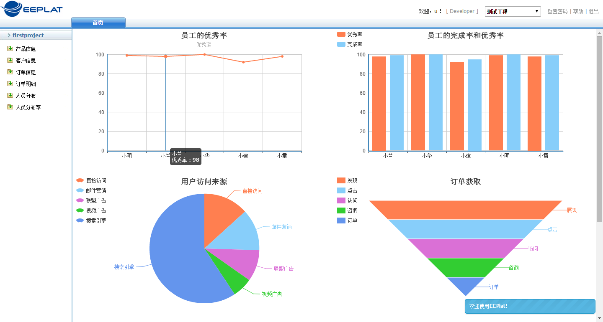
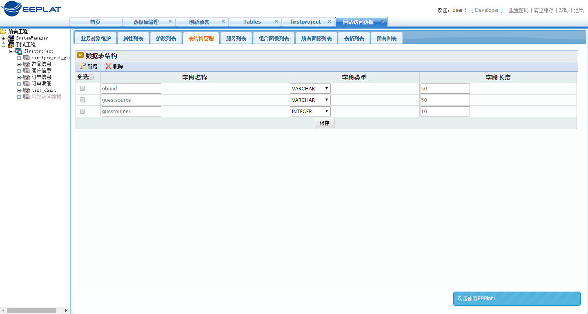
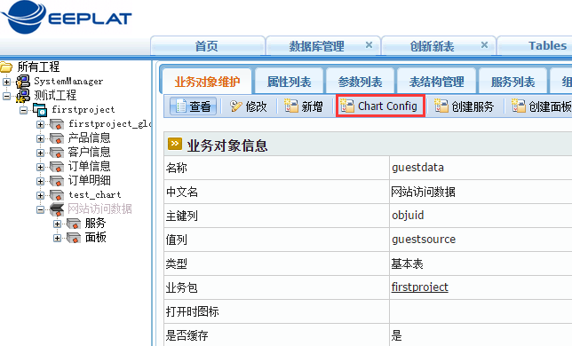
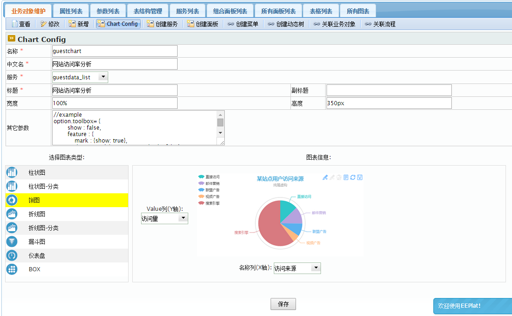

	EEPlat 最新版继承了百度的eChart组件，方便建立各种统计图表。如下图所示：
	
> 

	
	在这里，我们将简单介绍EEPlat的图表配置功能。
	首先我们建立一张Demo数据表。如用户访问来源，Demo表包含三个字段：关键字、来源、来源数量。然后输入Demo数据，展示来源分布率图表。
	创建表如下，并初始化。
> 
	点击完成初始化后的业务对象，选择菜单“ChartConfig”
> 
	输入相关信息，并选择饼图，如下图：
> 
	选择的服务是图表的数据来源，我们这里使用默认的list即可，实际使用可以根据自己的需求配置相应的服务以获取数据。
	配置完成后点击保存，会生成一个面板，通过业务对象的标签页“所有图表”可以访问，也可以直接通过业务对象下的面板找到想应的图表面板。
> 

	下面我们定义一个菜单关联到这个面板，
> 

	登录业务系统，点击网络访问数据菜单，输入测试数据，
> 
	输入完成后，点击网站访问率，查看到下面的图表：
> 
	
	看，EEPlat的图表就是如此简单。

	当然，可以在上面定义一个条件面板，根据输入条件执行带条件的服务，可以刷新面板数据。也可以和其他面板组成界面的各种样式。
